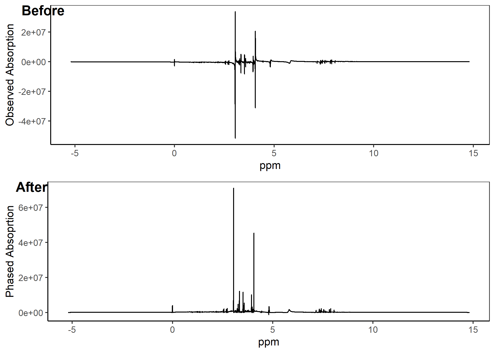
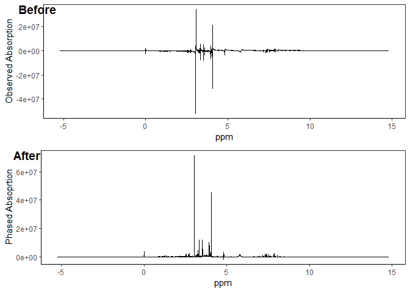
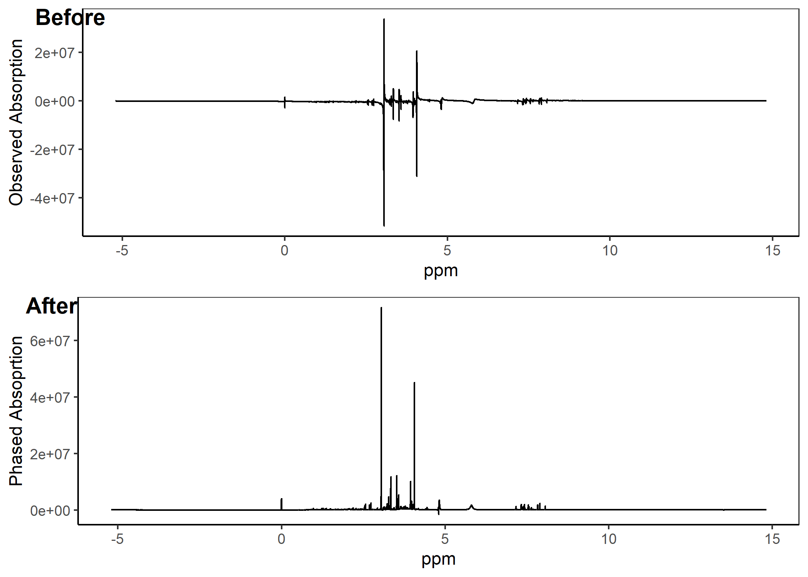
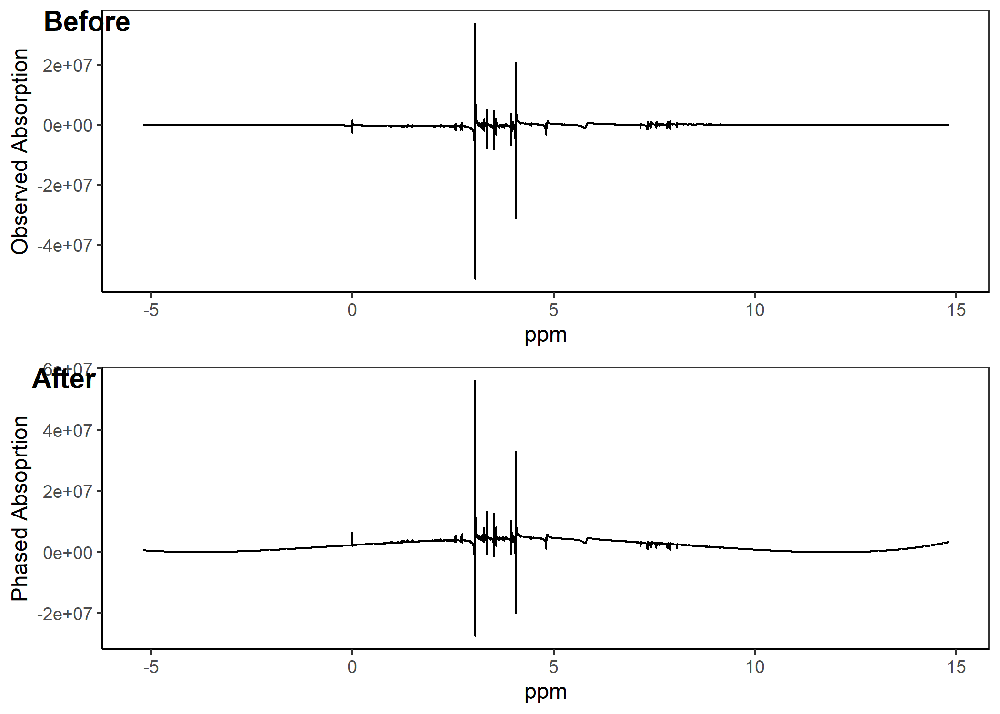

# NMRphasing

R package for NMR data phase error correction

## I. NMRphasing installation

First of all, make sure that you have R package MassSpecWavelet, which
NMRphasing depends on. Example code to install MassSpecWavelet is:

if (!requireNamespace(“BiocManager”, quietly = TRUE))
install.packages(“BiocManager”) BiocManager::install(“MassSpecWavelet”)

Now, let’s install NMRphasing from Github

    devtools :: install_github(repo = "ajiangsfu/NMRphasing",force = TRUE)  ## if you do not have old versions of NMRphasing, please remove force = TRUE

## II. Data format

The input data format should be in one of the four formats: 1) a vector
of absorption spectrum 2) a complex vector 3) a data matrix with two
columns of spectrum data, the 1st column is for absorption spectrum, and
2nd column is for dispersion spectrum 4) a data frame with two columns
of spectrum data, the 1st column is for absorption spectrum, and 2nd
column is for dispersion spectrum

An example data can be loaded after installing NMRphasing:

    library(NMRphasing)
    load(system.file("extdata", "fdat.rda", package = "NMRphasing"))
    str(fdat)

    ## 'data.frame':    131072 obs. of  2 variables:
    ##  $ frequency_domain: cplx  -4049+252i -4338-148i -4573-216i ...
    ##  $ ppm             : num  14.8 14.8 14.8 14.8 14.8 ...

Here, fdat$frequency\_domain is the data for the following illustration,
which is a complex vector. In order to make comparison, absorption part
can be extracted

    Obs_absorption = Re(fdat$frequency_domain)

## III.

There are currently seven NMR phase error correction methods implemented
in this package: “NLS”, “MPC\_DAOM”, “MPC\_EMP”, “SPC\_DAOM”,
“SPC\_EMP”, “SPC\_AAM”, and “SPC\_DSM”

### 1. NLS

This is to use our new Shrinkage method to do phase error correction.

    nlsp = NMRphasing(specDatIn = fdat$frequency_domain, method = "NLS") ## NLS is the default method, method setting can be ignored

    ### plot to compare before and after phase error correction

    nlsdat = cbind(fdat$ppm, Obs_absorption, nlsp)
    nlsdat = data.frame(nlsdat)
    colnames(nlsdat) = c("ppm", "Observed_Absorption", "Phased_Absoprtion")

    library(ggpubr)

    ## Loading required package: ggplot2

    ## Warning: package 'ggplot2' was built under R version 4.0.4

    p1 = ggplot(nlsdat, aes(x = ppm, y = Observed_Absorption)) +
          geom_line() + theme_bw() + labs(y = "Observed Absorption") +
          theme(panel.grid.major = element_blank(), panel.grid.minor = element_blank(),
            panel.background = element_blank(), axis.line = element_line(colour = "black"))
    p2 = ggplot(nlsdat, aes(x = ppm, y = Phased_Absoprtion)) +
          geom_line() + theme_bw() + labs(y = "Phased Absoprtion") +
            theme(panel.grid.major = element_blank(), panel.grid.minor = element_blank(),
            panel.background = element_blank(), axis.line = element_line(colour = "black"))
    ggarrange(plotlist = list(p1,p2),labels = c("Before","After"),nrow = 2, ncol=1)

### 2. MPC\_DAOM

This is to use our new multiple linear model approach with our new
optimization function to minimize difference between absolute area and
ordinary area.

    mdaomp = NMRphasing(specDatIn = fdat$frequency_domain, method = "MPC_DAOM") 
    ## this step might take a couple of minutes

    ### plot to compare before and after phase error correction

    pdat = nlsdat
    pdat$Phased_Absoprtion = mdaomp

    p1 = ggplot(pdat, aes(x = ppm, y = Observed_Absorption)) +
          geom_line() + theme_bw() + labs(y = "Observed Absorption") +
          theme(panel.grid.major = element_blank(), panel.grid.minor = element_blank(),
            panel.background = element_blank(), axis.line = element_line(colour = "black"))
    p2 = ggplot(pdat, aes(x = ppm, y = Phased_Absoprtion)) +
          geom_line() + theme_bw() + labs(y = "Phased Absoprtion") +
            theme(panel.grid.major = element_blank(), panel.grid.minor = element_blank(),
            panel.background = element_blank(), axis.line = element_line(colour = "black"))
    ggarrange(plotlist = list(p1,p2),labels = c("Before","After"),nrow = 2, ncol=1)

### 3. MPC\_EMP

This is our new multiple linear model approach based on entropy
minimization with negative peak penalty

    mempp = NMRphasing(specDatIn = fdat$frequency_domain, method = "MPC_EMP") 
    ## this step might take a couple of minutes

    ### plot to compare before and after phase error correction

    pdat$Phased_Absoprtion = mempp

    p1 = ggplot(pdat, aes(x = ppm, y = Observed_Absorption)) +
          geom_line() + theme_bw() + labs(y = "Observed Absorption") +
          theme(panel.grid.major = element_blank(), panel.grid.minor = element_blank(),
            panel.background = element_blank(), axis.line = element_line(colour = "black"))
    p2 = ggplot(pdat, aes(x = ppm, y = Phased_Absoprtion)) +
          geom_line() + theme_bw() + labs(y = "Phased Absoprtion") +
            theme(panel.grid.major = element_blank(), panel.grid.minor = element_blank(),
            panel.background = element_blank(), axis.line = element_line(colour = "black"))
    ggarrange(plotlist = list(p1,p2),labels = c("Before","After"),nrow = 2, ncol=1)

### 4. SPC\_DAOM

This phase error correction method is based on the traditional single
model approach but with our new optimization function to minimize
difference between absolute area and ordinal area.

    daomp = NMRphasing(specDatIn = fdat$frequency_domain, method = "SPC_DAOM") 
    ## this step might take a couple of minutes

    ### plot to compare before and after phase error correction

    pdat$Phased_Absoprtion = daomp

    p1 = ggplot(pdat, aes(x = ppm, y = Observed_Absorption)) +
          geom_line() + theme_bw() + labs(y = "Observed Absorption") +
          theme(panel.grid.major = element_blank(), panel.grid.minor = element_blank(),
            panel.background = element_blank(), axis.line = element_line(colour = "black"))
    p2 = ggplot(pdat, aes(x = ppm, y = Phased_Absoprtion)) +
          geom_line() + theme_bw() + labs(y = "Phased Absoprtion") +
            theme(panel.grid.major = element_blank(), panel.grid.minor = element_blank(),
            panel.background = element_blank(), axis.line = element_line(colour = "black"))
    ggarrange(plotlist = list(p1,p2),labels = c("Before","After"),nrow = 2, ncol=1)

 \#\#\# 5.
SPC\_EMP This is an old phase error method based on the traditional
single model approach targeting on entropy minimization with negative
peak penalty

    empp = NMRphasing(specDatIn = fdat$frequency_domain, method = "SPC_EMP") 
    ## this step might take a couple of minutes

    ### plot to compare before and after phase error correction

    pdat$Phased_Absoprtion = empp

    p1 = ggplot(pdat, aes(x = ppm, y = Observed_Absorption)) +
          geom_line() + theme_bw() + labs(y = "Observed Absorption") +
          theme(panel.grid.major = element_blank(), panel.grid.minor = element_blank(),
            panel.background = element_blank(), axis.line = element_line(colour = "black"))
    p2 = ggplot(pdat, aes(x = ppm, y = Phased_Absoprtion)) +
          geom_line() + theme_bw() + labs(y = "Phased Absoprtion") +
            theme(panel.grid.major = element_blank(), panel.grid.minor = element_blank(),
            panel.background = element_blank(), axis.line = element_line(colour = "black"))
    ggarrange(plotlist = list(p1,p2),labels = c("Before","After"),nrow = 2, ncol=1)

### 6. SPC\_AAM

This is an old phase error method based on the traditional single model
approach with minimization on absolute area

    aamp = NMRphasing(specDatIn = fdat$frequency_domain, method = "SPC_AAM") 
    ## this step might take a couple of minutes

    ### plot to compare before and after phase error correction

    pdat$Phased_Absoprtion = aamp

    p1 = ggplot(pdat, aes(x = ppm, y = Observed_Absorption)) +
          geom_line() + theme_bw() + labs(y = "Observed Absorption") +
          theme(panel.grid.major = element_blank(), panel.grid.minor = element_blank(),
            panel.background = element_blank(), axis.line = element_line(colour = "black"))
    p2 = ggplot(pdat, aes(x = ppm, y = Phased_Absoprtion)) +
          geom_line() + theme_bw() + labs(y = "Phased Absoprtion") +
            theme(panel.grid.major = element_blank(), panel.grid.minor = element_blank(),
            panel.background = element_blank(), axis.line = element_line(colour = "black"))
    ggarrange(plotlist = list(p1,p2),labels = c("Before","After"),nrow = 2, ncol=1)

 \#\#\# 7.
SPC\_DSM This is an old phase error method based on the traditional
single model approach with dispersion summation minimization.

    dsmp = NMRphasing(specDatIn = fdat$frequency_domain, method = "SPC_DSM") 
    ## this step might take a couple of minutes

    ### plot to compare before and after phase error correction

    pdat$Phased_Absoprtion = dsmp

    p1 = ggplot(pdat, aes(x = ppm, y = Observed_Absorption)) +
          geom_line() + theme_bw() + labs(y = "Observed Absorption") +
          theme(panel.grid.major = element_blank(), panel.grid.minor = element_blank(),
            panel.background = element_blank(), axis.line = element_line(colour = "black"))
    p2 = ggplot(pdat, aes(x = ppm, y = Phased_Absoprtion)) +
          geom_line() + theme_bw() + labs(y = "Phased Absoprtion") +
            theme(panel.grid.major = element_blank(), panel.grid.minor = element_blank(),
            panel.background = element_blank(), axis.line = element_line(colour = "black"))
    ggarrange(plotlist = list(p1,p2),labels = c("Before","After"),nrow = 2, ncol=1)

## IV. NMRphasing R package general information

Version: 0.0.2

Author: Aixiang Jiang

Maintainer: Aixiang Jiang <aijiang@bccrc.ca>
<aixiang.jiang@pathology.ubc.ca>

Depends: R (&gt;= 4.0), baseline, splines, MassSpecWavelet

Suggests: knitr

VignetteBuilder: knitr
