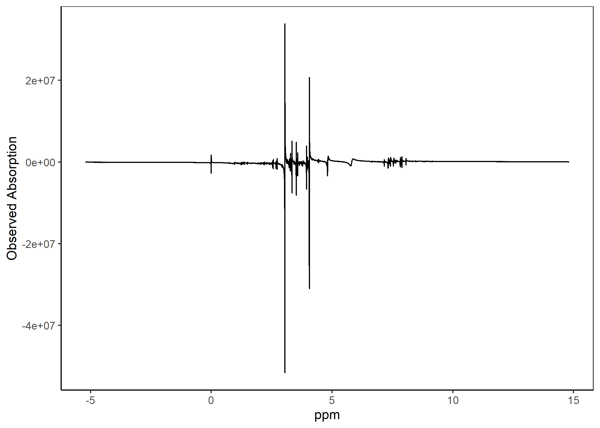

# NMRphasing

NMRphasing is an R package for NMR data phase error correction. Although
this is targeting on 1D NMR data, it can be applied to 2D and 3D NMR
data when a 1D NMR data file is phased at a time.

## I. NMRphasing installation

First of all, please make sure that you have R package MassSpecWavelet
that NMRphasing depends on. Example code to install MassSpecWavelet is:

if (!requireNamespace(“BiocManager”, quietly = TRUE))
install.packages(“BiocManager”) BiocManager::install(“MassSpecWavelet”)

Now, let’s install NMRphasing from Github

    devtools :: install_github(repo = "ajiangsfu/NMRphasing",force = TRUE)  
    ## if you do not have old versions of NMRphasing, please remove force = TRUE

## II. Data format

The input data format should be in one of the four formats: 1) a vector
of absorption spectrum 2) a complex vector 3) a data matrix with two
columns of spectrum data, the 1st column is for absorption spectrum, and
2nd column is for dispersion spectrum 4) a data frame with two columns
of spectrum data, the 1st column is for absorption spectrum, and 2nd
column is for dispersion spectrum

An example data from our multiple metabolite spike-in experiment can be
loaded after you install NMRphasing.

    library(NMRphasing)
    load(system.file("extdata", "fdat.rda", package = "NMRphasing"))
    str(fdat)

    ## 'data.frame':    131072 obs. of  2 variables:
    ##  $ frequency_domain: cplx  -4049+252i -4338-148i -4573-216i ...
    ##  $ ppm             : num  14.8 14.8 14.8 14.8 14.8 ...

Here, fdat$frequency\_domain is the data for the following illustration,
which is a complex vector.

    ## the following three lines are trying to avoid any possible conflict to the original data, and do not occupy extra space
    psout = fdat
    rm(fdat)
    gc()

    ##           used (Mb) gc trigger (Mb) max used (Mb)
    ## Ncells  604047 32.3    1250361 66.8   991073 53.0
    ## Vcells 1497549 11.5    8388608 64.0  2205467 16.9

    ## in order to make comparison, absorption part can be extracted
    psout$Observed_Absorption = Re(psout$frequency_domain)

    library(ggpubr)

    ## Loading required package: ggplot2

    ## Warning: package 'ggplot2' was built under R version 4.0.4

    p1 = ggplot(psout, aes(x = ppm, y = Observed_Absorption)) +
          geom_line() + theme_bw() + labs(y = "Observed Absorption") +
          theme(panel.grid.major = element_blank(), panel.grid.minor = element_blank(),
            panel.background = element_blank(), axis.line = element_line(colour = "black"))
    p1

The observed absorption spectrum without phase error correction looks
very bad.

## III. Example code

There are currently seven NMR phase error correction methods implemented
in this package, they are:“SPC\_DAOM”,“NLS”, “MPC\_DAOM”, “MPC\_EMP”,
“SPC\_EMP”, “SPC\_AAM”, and “SPC\_DSM”.

### 1. SPC\_DAOM

This is to use the traditional single linear model approach for phase
error correction but with our new optimization function to minimize
difference between absolute area and ordinary area.

    psout$Phased_Absoprtion = NMRphasing(specDatIn = psout$frequency_domain, method = "SPC_DAOM") 
    ### this step might take a couple of minutes

    p2 = ggplot(psout, aes(x = ppm, y = Phased_Absoprtion)) +
          geom_line() + theme_bw() + labs(y = "Phased Absoprtion") +
            theme(panel.grid.major = element_blank(), panel.grid.minor = element_blank(),
            panel.background = element_blank(), axis.line = element_line(colour = "black"))
    ggarrange(plotlist = list(p1,p2),labels = c("Before","After"),nrow = 2, ncol=1)

### 2. NLS

This is our new shrinkage method, which is the fastest phase error
correction method since it does not involve any optimization step.

    psout$Phased_Absoprtion = NMRphasing(specDatIn = psout$frequency_domain, method = "NLS") 
    ## this is the default method, therefore, the method setting can be ignored

    p2 = ggplot(psout, aes(x = ppm, y = Phased_Absoprtion)) +
          geom_line() + theme_bw() + labs(y = "Phased Absoprtion") +
            theme(panel.grid.major = element_blank(), panel.grid.minor = element_blank(),
            panel.background = element_blank(), axis.line = element_line(colour = "black"))
    ggarrange(plotlist = list(p1,p2),labels = c("Before","After"),nrow = 2, ncol=1)

### 3. MPC\_DAOM

This is ti use our new multiple linear model approach for phase error
correction with our new optimization function to minimize difference
between absolute area and ordinal area.

    psout$Phased_Absoprtion = NMRphasing(specDatIn = psout$frequency_domain, method = "MPC_DAOM") 
    ## this step might take a couple of minutes

    p2 = ggplot(psout, aes(x = ppm, y = Phased_Absoprtion)) +
          geom_line() + theme_bw() + labs(y = "Phased Absoprtion") +
            theme(panel.grid.major = element_blank(), panel.grid.minor = element_blank(),
            panel.background = element_blank(), axis.line = element_line(colour = "black"))
    ggarrange(plotlist = list(p1,p2),labels = c("Before","After"),nrow = 2, ncol=1)

### 4. MPC\_EMP

This is to apply our new multiple linear model approach for phase error
correction based on an existing optimization function: entropy
minimization with negative peak penalty.

    psout$Phased_Absoprtion = NMRphasing(specDatIn = psout$frequency_domain, method = "MPC_EMP") 
    ## this step might take a couple of minutes

    p2 = ggplot(psout, aes(x = ppm, y = Phased_Absoprtion)) +
          geom_line() + theme_bw() + labs(y = "Phased Absoprtion") +
            theme(panel.grid.major = element_blank(), panel.grid.minor = element_blank(),
            panel.background = element_blank(), axis.line = element_line(colour = "black"))
    ggarrange(plotlist = list(p1,p2),labels = c("Before","After"),nrow = 2, ncol=1)

### 5. SPC\_EMP

This is an old phase error correction method based on the traditional
single model approach targeting on an existing optimization function:
entropy minimization with negative peak penalty.

    psout$Phased_Absoprtion = NMRphasing(specDatIn = psout$frequency_domain, method = "SPC_EMP") 
    ## this step might take a couple of minutes

    p2 = ggplot(psout, aes(x = ppm, y = Phased_Absoprtion)) +
          geom_line() + theme_bw() + labs(y = "Phased Absoprtion") +
            theme(panel.grid.major = element_blank(), panel.grid.minor = element_blank(),
            panel.background = element_blank(), axis.line = element_line(colour = "black"))
    ggarrange(plotlist = list(p1,p2),labels = c("Before","After"),nrow = 2, ncol=1)

### 6. SPC\_AAM

This is an old phase error correction method based on the traditional
single model approach with an existing optimization function: absolute
area minimization.

    psout$Phased_Absoprtion = NMRphasing(specDatIn = psout$frequency_domain, method = "SPC_AAM") 
    ## this step might take a couple of minutes

    p2 = ggplot(psout, aes(x = ppm, y = Phased_Absoprtion)) +
          geom_line() + theme_bw() + labs(y = "Phased Absoprtion") +
            theme(panel.grid.major = element_blank(), panel.grid.minor = element_blank(),
            panel.background = element_blank(), axis.line = element_line(colour = "black"))
    ggarrange(plotlist = list(p1,p2),labels = c("Before","After"),nrow = 2, ncol=1)

### 7. SPC\_DSM

This is an old phase error correction method based on the traditional
single model approach with an existing optimization function: dispersion
summation minimization.

    psout$Phased_Absoprtion = NMRphasing(specDatIn = psout$frequency_domain, method = "SPC_DSM") 
    ## this step might take a couple of minutes

    p2 = ggplot(psout, aes(x = ppm, y = Phased_Absoprtion)) +
          geom_line() + theme_bw() + labs(y = "Phased Absoprtion") +
            theme(panel.grid.major = element_blank(), panel.grid.minor = element_blank(),
            panel.background = element_blank(), axis.line = element_line(colour = "black"))
    ggarrange(plotlist = list(p1,p2),labels = c("Before","After"),nrow = 2, ncol=1)

 

SPC\_DSM performs the worst on phase error correction based on our example data.

Side notes:
a) With a single CPU, it takes about 10 minutes to process all R code
b) Files with higher resolution plots can be found within folder "docs", there are in three formats: pdf, word, and html

## IV. NMRphasing R package general information

Version: 0.0.2

Author: Aixiang Jiang

Maintainer: Aixiang Jiang <aijiang@bccrc.ca>
<aixiang.jiang@pathology.ubc.ca>

Depends: R (&gt;= 4.0), baseline, splines, MassSpecWavelet

Suggests: knitr

VignetteBuilder: knitr
