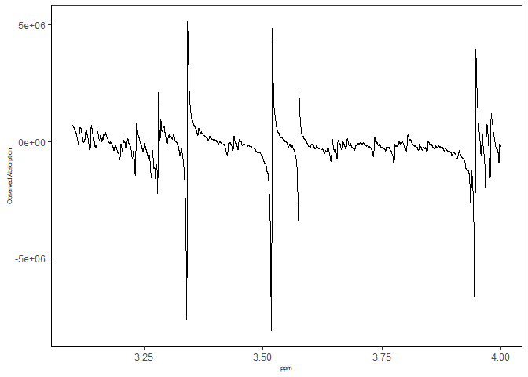
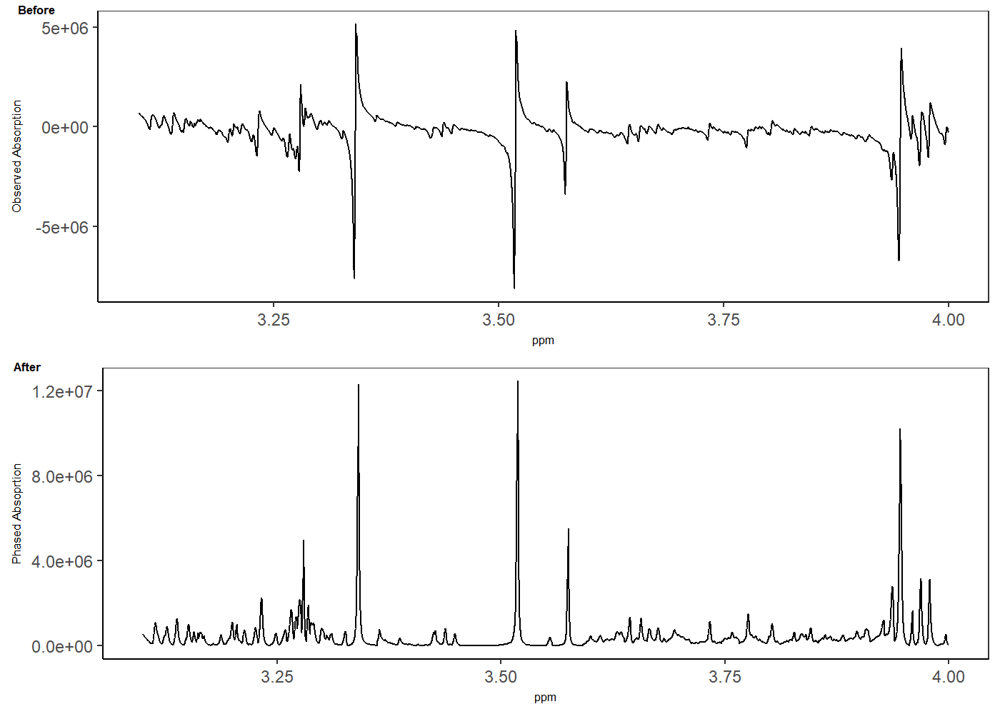
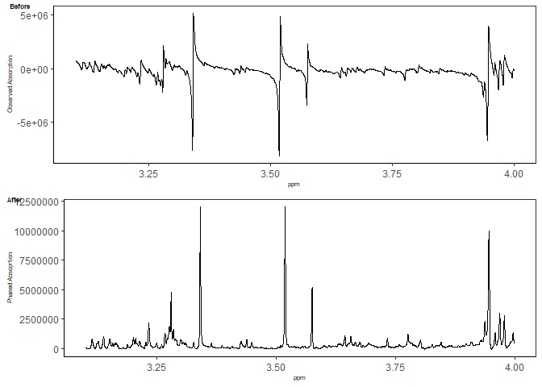
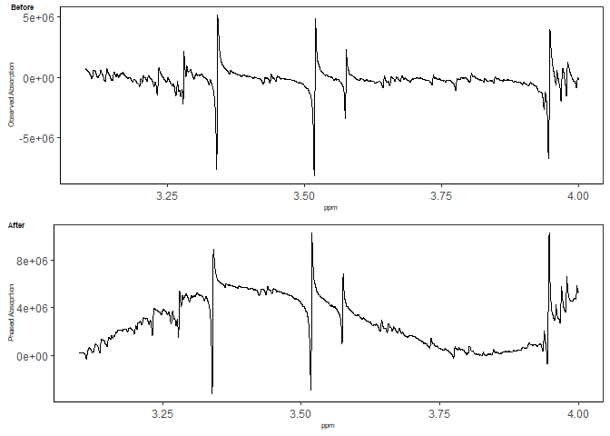

# NMRphasing

NMRphasing is an R package designed for the correction of phase errors
in NMR data. While its primary focus is on 1D NMR data, it can also be
employed for 2D and 3D NMR data by processing one 1D NMR data file at a
time.

## I. NMRphasing installation

First of all, please ensure that you have the R package MassSpecWavelet,
which is a dependency for NMRphasing. You can install MassSpecWavelet
using the following example code:

if (!requireNamespace(“BiocManager”, quietly = TRUE))
install.packages(“BiocManager”) BiocManager::install(“MassSpecWavelet”)

NMRphasing is available on CRAN, and we can directly install it in R:

    install.packages("NMRphasing")

Alternatively, let’s proceed to install NMRphasing from GitHub.

    devtools :: install_github(repo = "ajiangsfu/NMRphasing",force = TRUE)  
    ## if you do not have old versions of NMRphasing, please remove force = TRUE

## II. Data format

The input data for NMRphasing can be in one of four formats:

1.  A vector of absorption spectrum.
2.  A complex vector.
3.  A data matrix with two columns of spectrum data, where the first
    column represents the absorption spectrum, and the second column
    represents the dispersion spectrum.
4.  A data frame with two columns of spectrum data, where the first
    column is for the absorption spectrum, and the second column is for
    the dispersion spectrum.

After installing NMRphasing, you can load a subset of example data from
our multiple metabolite spike-in experiment using the following code
snippet:

    library(NMRphasing)
    data("fdat")
    str(fdat)

    ## 'data.frame':    5891 obs. of  2 variables:
    ##  $ frequency_domain: cplx  -252643-294983i -221414-311592i -189411-330984i ...
    ##  $ ppm             : num  4 4 4 4 4 ...

In the code above, we load the dataset ‘fdat’ from the package.
‘fdat$frequency\_domain’ represents the complex vector used in the
following illustration, while ‘freq’ is utilized for plotting purposes.
If your NMR data uses ppm values, you can substitute ‘ppm’ accordingly.

    ## in order to make comparison, absorption part can be extracted
    fdat$Observed_Absorption = Re(fdat$frequency_domain)

    library(ggpubr)

    ## Loading required package: ggplot2

    p1 = ggplot(fdat, aes(x = ppm, y = Observed_Absorption)) +
          geom_line() + theme_bw() + labs(y = "Observed Absorption") +
          theme(panel.grid.major = element_blank(), panel.grid.minor = element_blank(),
            panel.background = element_blank(), axis.line = element_line(colour = "black"),
            axis.title.x = element_text(size = 6), 
            axis.title.y = element_text(size = 6))
    p1

The observed absorption spectrum without phase error correction looks
very bad.

## III. Example Code

In this package, there are currently nine NMR phase error correction
methods implemented. They are as follows: “NLS”,
“SPC\_DANM”,“MPC\_DANM”, “SPC\_EMP”, “MPC\_EMP”,“SPC\_AAM”,“MPC\_AAM”,
“SPC\_DSM” and “MPC\_DSM”.

### 1. NLS

This is our new shrinkage method, which is the fastest phase error
correction method since it does not involve any optimization step.

    fdat$Phased_Absoprtion = NMRphasing(specDatIn = fdat$frequency_domain, method = "NLS") 

    p2 = ggplot(fdat, aes(x = ppm, y = Phased_Absoprtion)) +
          geom_line() + theme_bw() + labs(y = "Phased Absoprtion") +
            theme(panel.grid.major = element_blank(), panel.grid.minor = element_blank(),
            panel.background = element_blank(), axis.line = element_line(colour = "black"),
            axis.title.x = element_text(size = 6), 
            axis.title.y = element_text(size = 6))
    ggarrange(plotlist = list(p1,p2),labels = c("Before","After"),font.label = list(size = 6),nrow = 2, ncol=1)

The default setting for ‘withBC’ is TRUE, which tests for baseline bias
based on spline regression on the lowess line. If the maximum of
adjusted squared r is greater than 0.2, baseline correction is performed
with modified polynomial fitting.

If you set ‘withBC’ as FALSE, then no baseline bias will be tested and
corrected. The example code is:

    fdat$Phased_Absoprtion = NMRphasing(specDatIn = fdat$frequency_domain, method = "NLS", withBC = FALSE) 

### 2. SPC\_DANM

The “SPC\_DANM” method employs the traditional single linear model
approach for phase error correction but incorporates a new optimization
function designed to minimize the difference between absolute area and
net area.

    fdat$Phased_Absoprtion = NMRphasing(specDatIn = fdat$frequency_domain, method = "SPC_DANM") 

    p2 = ggplot(fdat, aes(x = ppm, y = Phased_Absoprtion)) +
          geom_line() + theme_bw() + labs(y = "Phased Absoprtion") +
            theme(panel.grid.major = element_blank(), panel.grid.minor = element_blank(),
            panel.background = element_blank(), axis.line = element_line(colour = "black"),
            axis.title.x = element_text(size = 6), 
            axis.title.y = element_text(size = 6))
    ggarrange(plotlist = list(p1,p2),labels = c("Before","After"),font.label = list(size = 6),nrow = 2, ncol=1)

### 3. MPC\_DANM

This approach utilizes our new multiple linear model for phase error
correction along with our optimization function designed to minimize the
difference between absolute area and net area.

    fdat$Phased_Absoprtion = NMRphasing(specDatIn = fdat$frequency_domain, method = "MPC_DANM") 

    p2 = ggplot(fdat, aes(x = ppm, y = Phased_Absoprtion)) +
          geom_line() + theme_bw() + labs(y = "Phased Absoprtion") +
            theme(panel.grid.major = element_blank(), panel.grid.minor = element_blank(),
            panel.background = element_blank(), axis.line = element_line(colour = "black"),
            axis.title.x = element_text(size = 6), 
            axis.title.y = element_text(size = 6))
    ggarrange(plotlist = list(p1,p2),labels = c("Before","After"),font.label = list(size = 6),nrow = 2, ncol=1)

### 4. SPC\_EMP

This is an old phase error correction method based on the traditional
single model approach targeting on an existing optimization function:
entropy minimization with negative peak penalty.

    fdat$Phased_Absoprtion = NMRphasing(specDatIn = fdat$frequency_domain, method = "SPC_EMP") 

    p2 = ggplot(fdat, aes(x = ppm, y = Phased_Absoprtion)) +
          geom_line() + theme_bw() + labs(y = "Phased Absoprtion") +
            theme(panel.grid.major = element_blank(), panel.grid.minor = element_blank(),
            panel.background = element_blank(), axis.line = element_line(colour = "black"),
            axis.title.x = element_text(size = 6), 
            axis.title.y = element_text(size = 6))
    ggarrange(plotlist = list(p1,p2),labels = c("Before","After"),font.label = list(size = 6),nrow = 2, ncol=1)

### 5. MPC\_EMP

This is to apply our new multiple linear model approach for phase error
correction based on an existing optimization function: entropy
minimization with negative peak penalty.

    fdat$Phased_Absoprtion = NMRphasing(specDatIn = fdat$frequency_domain, method = "MPC_EMP") 

    p2 = ggplot(fdat, aes(x = ppm, y = Phased_Absoprtion)) +
          geom_line() + theme_bw() + labs(y = "Phased Absoprtion") +
            theme(panel.grid.major = element_blank(), panel.grid.minor = element_blank(),
            panel.background = element_blank(), axis.line = element_line(colour = "black"),
            axis.title.x = element_text(size = 6), 
            axis.title.y = element_text(size = 6))
    ggarrange(plotlist = list(p1,p2),labels = c("Before","After"),font.label = list(size = 6),nrow = 2, ncol=1)

### 6. SPC\_AAM

This is an old phase error correction method based on the traditional
single model approach with an existing optimization function: absolute
area minimization.

    fdat$Phased_Absoprtion = NMRphasing(specDatIn = fdat$frequency_domain, method = "SPC_AAM") 

    p2 = ggplot(fdat, aes(x = ppm, y = Phased_Absoprtion)) +
          geom_line() + theme_bw() + labs(y = "Phased Absoprtion") +
            theme(panel.grid.major = element_blank(), panel.grid.minor = element_blank(),
            panel.background = element_blank(), axis.line = element_line(colour = "black"),
            axis.title.x = element_text(size = 6), 
            axis.title.y = element_text(size = 6))
    ggarrange(plotlist = list(p1,p2),labels = c("Before","After"),font.label = list(size = 6),nrow = 2, ncol=1)

### 7. MPC\_AAM

This is to apply our new multiple linear model approach for phase error
correction based on an existing optimization function:absolute area
minimization.

    fdat$Phased_Absoprtion = NMRphasing(specDatIn = fdat$frequency_domain, method = "MPC_AAM") 

    p2 = ggplot(fdat, aes(x = ppm, y = Phased_Absoprtion)) +
          geom_line() + theme_bw() + labs(y = "Phased Absoprtion") +
            theme(panel.grid.major = element_blank(), panel.grid.minor = element_blank(),
            panel.background = element_blank(), axis.line = element_line(colour = "black"),
            axis.title.x = element_text(size = 6), 
            axis.title.y = element_text(size = 6))
    ggarrange(plotlist = list(p1,p2),labels = c("Before","After"),font.label = list(size = 6),nrow = 2, ncol=1)

### 8. SPC\_DSM

This is an old phase error correction method based on the traditional
single model approach with an existing optimization function: dispersion
summation minimization.

    fdat$Phased_Absoprtion = NMRphasing(specDatIn = fdat$frequency_domain, method = "SPC_DSM") 

    p2 = ggplot(fdat, aes(x = ppm, y = Phased_Absoprtion)) +
          geom_line() + theme_bw() + labs(y = "Phased Absoprtion") +
            theme(panel.grid.major = element_blank(), panel.grid.minor = element_blank(),
            panel.background = element_blank(), axis.line = element_line(colour = "black"),
            axis.title.x = element_text(size = 6), 
            axis.title.y = element_text(size = 6))
    ggarrange(plotlist = list(p1,p2),labels = c("Before","After"),font.label = list(size = 6),nrow = 2, ncol=1)

### 9. MPC\_DSM

This is to apply our new multiple linear model approach for phase error
correction based on an existing optimization function:dispersion
summation minimization..

    fdat$Phased_Absoprtion = NMRphasing(specDatIn = fdat$frequency_domain, method = "MPC_DSM") 

    p2 = ggplot(fdat, aes(x = ppm, y = Phased_Absoprtion)) +
          geom_line() + theme_bw() + labs(y = "Phased Absoprtion") +
            theme(panel.grid.major = element_blank(), panel.grid.minor = element_blank(),
            panel.background = element_blank(), axis.line = element_line(colour = "black"),
            axis.title.x = element_text(size = 6), 
            axis.title.y = element_text(size = 6))
    ggarrange(plotlist = list(p1,p2),labels = c("Before","After"),font.label = list(size = 6),nrow = 2, ncol=1)

## IV. NMRphasing R package general information

    devtools::session_info()

    ## ─ Session info ───────────────────────────────────────────────────────────────
    ##  setting  value
    ##  version  R version 4.3.2 (2023-10-31 ucrt)
    ##  os       Windows 11 x64 (build 22631)
    ##  system   x86_64, mingw32
    ##  ui       RTerm
    ##  language (EN)
    ##  collate  English_United States.utf8
    ##  ctype    English_United States.utf8
    ##  tz       America/Vancouver
    ##  date     2024-01-19
    ##  pandoc   3.1.8 @ C:/PROGRA~1/Pandoc/ (via rmarkdown)
    ## 
    ## ─ Packages ───────────────────────────────────────────────────────────────────
    ##  package         * version date (UTC) lib source
    ##  abind             1.4-5   2016-07-21 [1] CRAN (R 4.3.1)
    ##  backports         1.4.1   2021-12-13 [1] CRAN (R 4.3.1)
    ##  baseline          1.3-5   2023-11-18 [1] CRAN (R 4.3.2)
    ##  broom             1.0.5   2023-06-09 [1] CRAN (R 4.3.1)
    ##  cachem            1.0.8   2023-05-01 [1] CRAN (R 4.3.1)
    ##  car               3.1-2   2023-03-30 [1] CRAN (R 4.3.1)
    ##  carData           3.0-5   2022-01-06 [1] CRAN (R 4.3.1)
    ##  cli               3.6.2   2023-12-11 [1] CRAN (R 4.3.2)
    ##  colorspace        2.1-0   2023-01-23 [1] CRAN (R 4.3.1)
    ##  cowplot           1.1.2   2023-12-15 [1] CRAN (R 4.3.2)
    ##  devtools          2.4.5   2022-10-11 [1] CRAN (R 4.3.2)
    ##  digest            0.6.33  2023-07-07 [1] CRAN (R 4.3.1)
    ##  dplyr             1.1.4   2023-11-17 [1] CRAN (R 4.3.2)
    ##  ellipsis          0.3.2   2021-04-29 [1] CRAN (R 4.3.1)
    ##  evaluate          0.23    2023-11-01 [1] CRAN (R 4.3.2)
    ##  fansi             1.0.6   2023-12-08 [1] CRAN (R 4.3.2)
    ##  farver            2.1.1   2022-07-06 [1] CRAN (R 4.3.1)
    ##  fastmap           1.1.1   2023-02-24 [1] CRAN (R 4.3.1)
    ##  fs                1.6.3   2023-07-20 [1] CRAN (R 4.3.1)
    ##  generics          0.1.3   2022-07-05 [1] CRAN (R 4.3.1)
    ##  ggplot2         * 3.4.4   2023-10-12 [1] CRAN (R 4.3.1)
    ##  ggpubr          * 0.6.0   2023-02-10 [1] CRAN (R 4.3.1)
    ##  ggsignif          0.6.4   2022-10-13 [1] CRAN (R 4.3.1)
    ##  glue              1.6.2   2022-02-24 [1] CRAN (R 4.3.1)
    ##  gtable            0.3.4   2023-08-21 [1] CRAN (R 4.3.1)
    ##  highr             0.10    2022-12-22 [1] CRAN (R 4.3.1)
    ##  htmltools         0.5.7   2023-11-03 [1] CRAN (R 4.3.2)
    ##  htmlwidgets       1.6.4   2023-12-06 [1] CRAN (R 4.3.2)
    ##  httpuv            1.6.13  2023-12-06 [1] CRAN (R 4.3.2)
    ##  knitr             1.45    2023-10-30 [1] CRAN (R 4.3.1)
    ##  labeling          0.4.3   2023-08-29 [1] CRAN (R 4.3.1)
    ##  later             1.3.2   2023-12-06 [1] CRAN (R 4.3.2)
    ##  lifecycle         1.0.4   2023-11-07 [1] CRAN (R 4.3.2)
    ##  limSolve          1.5.7   2023-09-21 [1] CRAN (R 4.3.1)
    ##  lpSolve           5.6.20  2023-12-10 [1] CRAN (R 4.3.2)
    ##  magrittr          2.0.3   2022-03-30 [1] CRAN (R 4.3.1)
    ##  MASS              7.3-60  2023-05-04 [2] CRAN (R 4.3.2)
    ##  MassSpecWavelet   1.68.0  2023-10-24 [1] Bioconductor
    ##  memoise           2.0.1   2021-11-26 [1] CRAN (R 4.3.1)
    ##  mime              0.12    2021-09-28 [1] CRAN (R 4.3.1)
    ##  miniUI            0.1.1.1 2018-05-18 [1] CRAN (R 4.3.2)
    ##  munsell           0.5.0   2018-06-12 [1] CRAN (R 4.3.1)
    ##  NMRphasing      * 1.0.4   2024-01-19 [1] local
    ##  pillar            1.9.0   2023-03-22 [1] CRAN (R 4.3.1)
    ##  pkgbuild          1.4.3   2023-12-10 [1] CRAN (R 4.3.2)
    ##  pkgconfig         2.0.3   2019-09-22 [1] CRAN (R 4.3.1)
    ##  pkgload           1.3.3   2023-09-22 [1] CRAN (R 4.3.1)
    ##  profvis           0.3.8   2023-05-02 [1] CRAN (R 4.3.2)
    ##  promises          1.2.1   2023-08-10 [1] CRAN (R 4.3.2)
    ##  purrr             1.0.2   2023-08-10 [1] CRAN (R 4.3.1)
    ##  quadprog          1.5-8   2019-11-20 [1] CRAN (R 4.3.1)
    ##  R6                2.5.1   2021-08-19 [1] CRAN (R 4.3.1)
    ##  Rcpp              1.0.11  2023-07-06 [1] CRAN (R 4.3.1)
    ##  remotes           2.4.2.1 2023-07-18 [1] CRAN (R 4.3.2)
    ##  rlang             1.1.2   2023-11-04 [1] CRAN (R 4.3.2)
    ##  rmarkdown         2.25    2023-09-18 [1] CRAN (R 4.3.1)
    ##  rstatix           0.7.2   2023-02-01 [1] CRAN (R 4.3.1)
    ##  rstudioapi        0.15.0  2023-07-07 [1] CRAN (R 4.3.1)
    ##  scales            1.3.0   2023-11-28 [1] CRAN (R 4.3.2)
    ##  sessioninfo       1.2.2   2021-12-06 [1] CRAN (R 4.3.2)
    ##  shiny             1.8.0   2023-11-17 [1] CRAN (R 4.3.2)
    ##  SparseM           1.81    2021-02-18 [1] CRAN (R 4.3.1)
    ##  stringi           1.8.3   2023-12-11 [1] CRAN (R 4.3.2)
    ##  stringr           1.5.1   2023-11-14 [1] CRAN (R 4.3.2)
    ##  tibble            3.2.1   2023-03-20 [1] CRAN (R 4.3.1)
    ##  tidyr             1.3.0   2023-01-24 [1] CRAN (R 4.3.1)
    ##  tidyselect        1.2.0   2022-10-10 [1] CRAN (R 4.3.1)
    ##  urlchecker        1.0.1   2021-11-30 [1] CRAN (R 4.3.2)
    ##  usethis           2.2.2   2023-07-06 [1] CRAN (R 4.3.2)
    ##  utf8              1.2.4   2023-10-22 [1] CRAN (R 4.3.1)
    ##  vctrs             0.6.5   2023-12-01 [1] CRAN (R 4.3.2)
    ##  withr             2.5.2   2023-10-30 [1] CRAN (R 4.3.1)
    ##  xfun              0.41    2023-11-01 [1] CRAN (R 4.3.2)
    ##  xtable            1.8-4   2019-04-21 [1] CRAN (R 4.3.1)
    ##  yaml              2.3.8   2023-12-11 [1] CRAN (R 4.3.2)
    ## 
    ##  [1] C:/Users/jiang/AppData/Local/R/win-library/4.3
    ##  [2] C:/Program Files/R/R-4.3.2/library
    ## 
    ## ──────────────────────────────────────────────────────────────────────────────

Version: 1.0.4 <Authors@R>: c( person(“Aixiang Jiang”, role = c(“aut”,
“cre”, “cph”), email = “<aijiang@bccrc.ca>”, comment = c(ORCID =
“0000-0002-6153-7595”)) ) Maintainer: Aixiang Jiang <aijiang@bccrc.ca>
Depends: R (&gt;= 4.3.0),stats Suggests: knitr, rmarkdown, ggpubr
VignetteBuilder: knitr Imports: baseline, splines, MassSpecWavelet
Description: There are three distinct approaches for phase error
correction, they are: a single linear model with a choice of
optimization functions, multiple linear models with optimization
function choices and a shrinkage-based method. The methodology is based
on our new algorithms and various references: Binczyk et al. (2015)
<doi:10.1186/1475-925X-14-S2-S5> Chen et al. (2002)
<doi:10.1016/S1090-7807(02)00069-1> de Brouwer (2009)
<doi:10.1016/j.jmr.2009.09.017> Džakula (2000)
<doi:10.1006/jmre.2000.2123> Ernst (1969)
<doi:10.1016/0022-2364(69)90003-1> Liland et al. (2010)
<doi:10.1366/000370210792434350> License: MIT + file LICENSE Encoding:
UTF-8 LazyData: true RoxygenNote: 7.2.3
